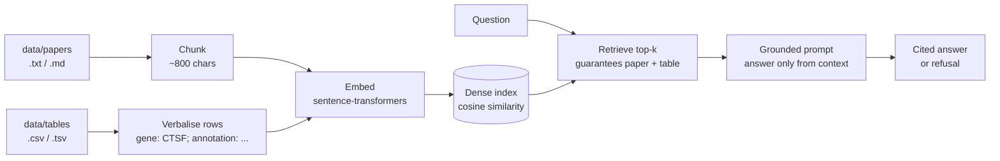
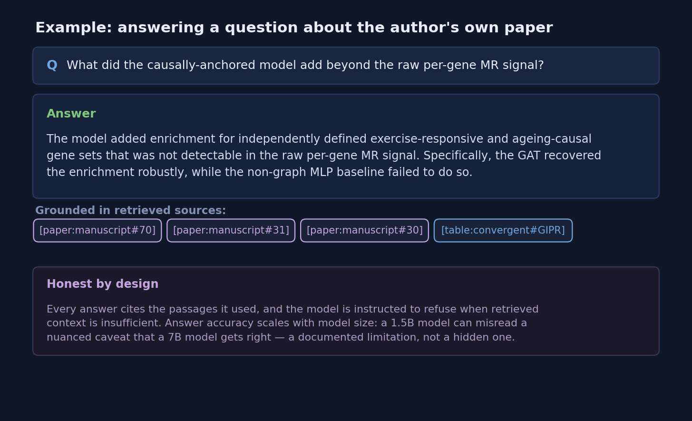
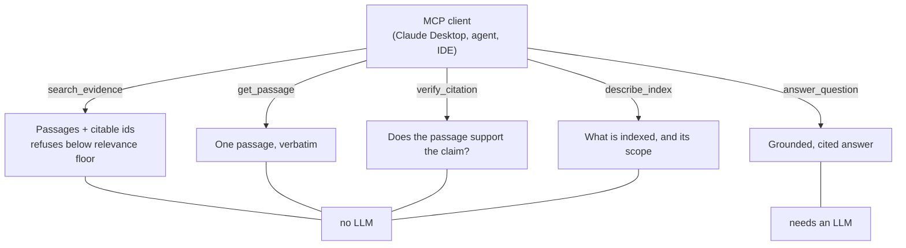

# Ask-my-research

**A retrieval-augmented generation (RAG) pipeline that answers questions about my research by retrieving from both the papers *and* the structured model outputs — and grounding every answer in cited sources.**

Most RAG demos retrieve from text only. Real research questions often need *both* the prose (the reasoning, the caveats) and the structured results (which genes, what scores). This pipeline indexes paper chunks and verbalised result-table rows in one store, so a single query draws on both — and every answer carries the passages it used, or refuses when the context is too thin.

It runs two ways: as a CLI that answers questions itself, or as an [MCP](https://modelcontextprotocol.io) server that lets any AI agent ground *its* reasoning in this research.

**The research it answers questions about:** Juan CG, Ntasis L. *Causally-anchored multi-omic deep learning recovers exercise-responsive and ageing-causal genes from human physical activity.* medRxiv 2026. [doi:10.64898/2025.12.26.25343061](https://doi.org/10.64898/2025.12.26.25343061)



---

## It works — on real research



The answer above is generated, not hard-coded: the pipeline retrieved the relevant paragraphs from the paper and a row from the results table, then grounded the model on them and cited each source.

---

## Why it's built this way

| Choice | Reason |
|---|---|
| **Heterogeneous retrieval** (papers + tables in one index) | Research answers need prose *and* structured results; rows are verbalised to text so one dense index serves both. |
| **Grounded generation with citations** | Every claim points back to a retrieved passage; the model is told to refuse when context is insufficient. |
| **Backend-agnostic LLM** | Same pipeline runs on a self-hosted/open-weight model (Ollama or HF Transformers) **or** a frontier API model — switchable with one flag. |
| **Offline self-test** | Ingestion + retrieval logic is verifiable with no model and no network. |
| **Agent-accessible over MCP** | Retrieval is exposed as tools, so a calling agent can reason over the evidence itself rather than receiving a finished answer. Four of the five need no LLM. |

## Quickstart

```bash
pip install -r requirements.txt

# verify the pipeline logic with no model, no network
python ask.py --selftest

# ask a question (free, local, open-weight via HF Transformers)
python ask.py --papers data/papers --tables data/tables \
              --backend transformers --model "Qwen/Qwen2.5-7B-Instruct" --k 12 \
              --q "What did the model add beyond the raw per-gene signal?"
```

Example data ships in `data/`, taken from the preprint above, so both selftests and the commands here run on a fresh clone with no setup. To use the pipeline for real, drop your own `.txt`/`.md` papers into `data/papers/` and `.csv`/`.tsv` result tables into `data/tables/`. A Colab notebook (`ask_my_research_colab.ipynb`) runs the whole thing on a free GPU.

### What ships in `data/`

| File | Contents |
|---|---|
| `papers/exercise_ageing_gat.md` | Methods and results: MR, trait importance scoring, the graph model, enrichment, CTSF validation, limitations. |
| `tables/enrichment_by_method.csv` | Enrichment p-values by method and ranking depth (paper Table 1). |
| `tables/molecular_layers.csv` | The five MR outcome layers: tissue, dataset, sample size. |
| `tables/gene_set_overlap.csv` | Three-way overlap counts within the 2,959-gene MR universe. |
| `tables/convergent_genes.csv` | The eight triple-convergent genes and their annotations. |
| `tables/ctsf_causal_validation.csv` | Cis-MR and colocalisation results against ageing outcomes. |

Every figure comes from the preprint, which remains the authoritative source. Replace both directories to point the pipeline at other work.

## How it works

1. **Ingest** — papers become ~800-char chunks; table rows are verbalised to text (`gene: CTSF; annotation: lysosomal proteostasis; ...`). Each chunk keeps a source id.
2. **Embed + index** — `sentence-transformers` (MiniLM); cosine similarity.
3. **Retrieve** — top-k, with an optional step that guarantees both a paper chunk and a table row when available.
4. **Generate** — a grounded prompt instructs the model to answer only from context, cite the ids it used, and decline when context is thin.

## What you can ask it

The example data pairs the paper's methods and results with five result tables,
so these questions need both halves of the index at once:

| Question | Draws on |
|---|---|
| *Which methods recovered the exercise-responsive gene set, and at what ranking depths?* | Paper text + `enrichment_by_method` |
| *What does the graph model add over the non-graph baseline?* | Paper text + `enrichment_by_method` |
| *Which genes sit in all three gene sets, and what do they do?* | Paper text + `convergent_genes` + `gene_set_overlap` |
| *Why did CTSF validate against exceptional longevity when FADS1 did not?* | Paper text + `ctsf_causal_validation` |
| *Which molecular layers were used, and from which datasets?* | Paper text + `molecular_layers` |

Ask it something the example data does not cover and it says so, rather than
reaching for what the model happens to know.

## MCP server

The same pipeline is exposed over the [Model Context Protocol](https://modelcontextprotocol.io), so any MCP client — Claude Desktop, an agent framework, an IDE — can ground its own reasoning in this research instead of answering from memory.

```bash
pip install "mcp[cli]"

python mcp_server.py --selftest   # exercises every tool, no LLM needed
python mcp_server.py              # stdio transport
```

The evidence tools need no LLM, but they do use the sentence-transformers embedding model, which downloads once (about 90MB) and is cached after that — so the first run needs network access and later runs do not.

Client config (e.g. Claude Desktop):

```json
{
  "mcpServers": {
    "ask-my-research": {
      "command": "python",
      "args": ["/abs/path/to/mcp_server.py"],
      "env": { "PAPERS_DIR": "data/papers", "TABLES_DIR": "data/tables" }
    }
  }
}
```



### Tools

| Tool | What it does | Needs an LLM? |
|---|---|---|
| `search_evidence` | Retrieve passages for a query, with citable ids. Refuses below a relevance floor. | No |
| `get_passage` | Fetch one passage verbatim by id, to check a citation in full. | No |
| `verify_citation` | Check whether a passage plausibly supports a claim attributed to it. | No |
| `describe_index` | Report what is indexed, so a caller knows the scope before asking. | No |
| `answer_question` | The pipeline's own grounded, cited answer. | Yes |

### Design decisions

**The agent does the reasoning; the server supplies the evidence.** Wrapping a RAG pipeline as a single `ask()` tool throws away the caller's reasoning and hands back a finished answer. Four of these five tools return evidence instead, and need no LLM at all — no Ollama, no API key, no GPU. A caller that wants to reason for itself never has to load a generator.

**Refusal moved to the tool boundary.** The pipeline already declines when context is thin, but that instruction lives in a prompt, where a model can talk itself past it. Here the check runs *before* passages are returned: below `MIN_SCORE`, `search_evidence` returns `grounded: false` and nothing else, so a weak match is never available to be mistaken for support.

**Citations are checkable, not just present.** `verify_citation` is the retrieval-side sibling of the offline self-test — it flags claims with no textual basis in the passage they cite.

### Environment

| Variable | Default | Purpose |
|---|---|---|
| `PAPERS_DIR` | `data/papers` | `.txt`/`.md` sources |
| `TABLES_DIR` | `data/tables` | `.csv`/`.tsv` result tables |
| `INDEX_PATH` | — | Cache embeddings to avoid re-embedding on each start |
| `EMBED_MODEL` | `all-MiniLM-L6-v2` | Sentence-transformers model |
| `MIN_SCORE` | `0.25` | Relevance floor below which search refuses |
| `LLM_BACKEND` | — | `ollama` / `anthropic` / `openai` / `transformers` |
| `LLM_MODEL` | — | Model name for the chosen backend |

## Honest scope

This is a **research prototype**, and its limits are part of the design, not hidden:

- **Answer accuracy scales with model size.** A small (1.5B) model can misread a nuanced caveat that a larger (7B) model gets right. The retrieval is the same; the generator is the variable. Use a 7B+ model for faithful answers.
- **Dense retrieval only** — no learned re-ranker. Nuanced single-sentence caveats are sometimes retrieved weakly; a re-ranker or stronger embedder would help.
- **The LLM and embedder are existing open-weight/API models, used as-is.** The pipeline, retrieval design, grounding, and citation logic are the contribution — not the models.
- **In-memory index** — fine for a personal collection; swap in FAISS/Chroma for scale.
- **`verify_citation` is lexical overlap, not entailment.** It catches claims with no textual basis in the passage cited; it cannot confirm that a well-overlapping claim is a *correct reading*. A proper check needs an NLI model or a second grader.
- **The relevance floor is one hand-tuned global threshold.** It is not calibrated per query type, and the right value depends on the documents.
- **The example data is a subset, not the paper.** It carries the methods, headline results and summary tables; the preprint remains the authoritative source for every figure.

## Files

| File | What it is |
|---|---|
| `ask.py` | CLI: build index, ask questions, offline `--selftest`. |
| `rag.py` | Ingestion (papers + tables), dense index, grounded-generation engine. |
| `llm_backend.py` | Backend-agnostic LLM interface: Ollama / Anthropic / OpenAI / Transformers. |
| `mcp_server.py` | MCP server: retrieval, citation-checking and grounded answering as agent tools. |
| `ask_my_research_colab.ipynb` | One-click Colab notebook (free GPU). |
| `requirements.txt` | Core dependencies; optional LLM backends commented out. |
| `data/` | Example data — see *What ships in `data/`* above. Replace with your own. |

## Related work

| Repo | What it is |
|---|---|
| [Causal-deep-learning-GNN-multi-omic](https://github.com/cgjuan01/Causal-deep-learning-GNN-multi-omic) | The analysis code behind the paper above: multi-omic MR across five layers, then a supervised graph attention network over the STRING interaction graph. |
| [protein-ligand-binding-affinity-ageing-targets](https://github.com/cgjuan01/protein-ligand-binding-affinity-ageing-targets) | Leakage-aware evaluation harness for binding-affinity models. |
| [protobind-ctsf-generative-triage](https://github.com/cgjuan01/protobind-ctsf-generative-triage) | Target-conditioned ligand generation with novelty triage. |
